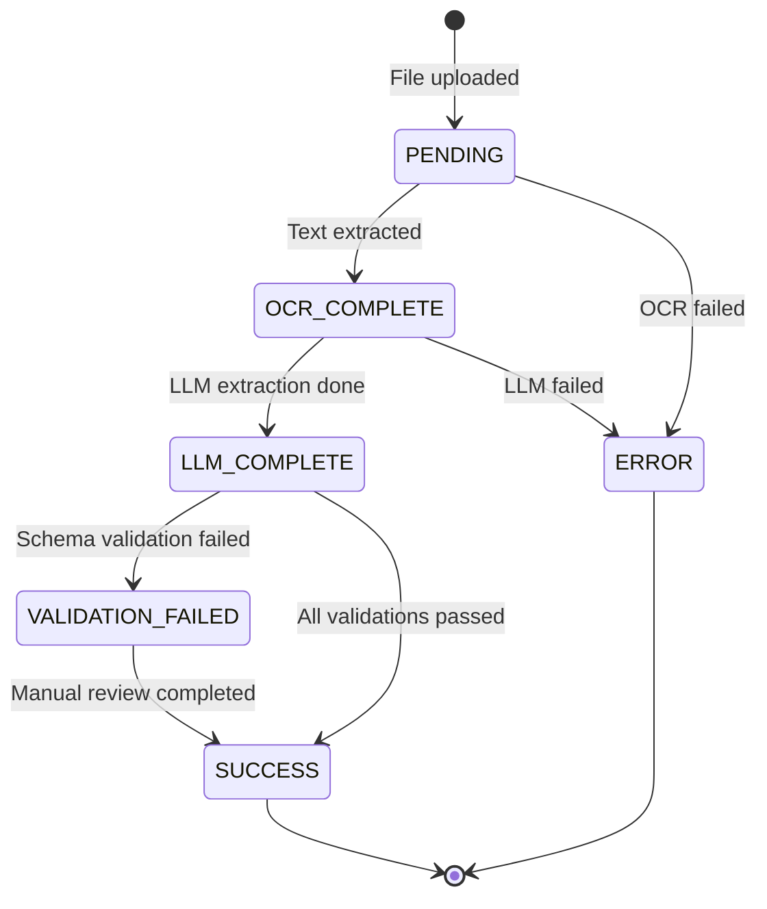

# Extraction Pipeline: InvoiceMe MVP

**Version**: 1.0
**Date**: 2026-01-18
**Purpose**: Document the OCR → LLM extraction flow with state machine

---

## Overview

The extraction pipeline transforms uploaded invoice files (PDF/images) into structured data through a multi-stage process involving OCR, LLM extraction, validation, vendor matching, and currency conversion.

**Processing Time Target**: < 30 seconds for standard invoices

---

## Pipeline Architecture

```
┌─────────────┐
│ File Upload │
└──────┬──────┘
       │
       ▼
┌─────────────────────────────────────────────────────────────┐
│                    EXTRACTION PIPELINE                       │
├─────────────────────────────────────────────────────────────┤
│                                                              │
│  ┌──────────────┐    ┌──────────────┐    ┌──────────────┐  │
│  │   Stage 1    │───►│   Stage 2    │───►│   Stage 3    │  │
│  │ File Storage │    │  OCR/Text    │    │ LLM Extract  │  │
│  │              │    │  Extraction  │    │              │  │
│  └──────────────┘    └──────────────┘    └──────────────┘  │
│                                                              │
│  ┌──────────────┐    ┌──────────────┐    ┌──────────────┐  │
│  │   Stage 4    │───►│   Stage 5    │───►│   Stage 6    │  │
│  │  Validation  │    │    Vendor    │    │   Currency   │  │
│  │              │    │   Matching   │    │  Conversion  │  │
│  └──────────────┘    └──────────────┘    └──────────────┘  │
│                                                              │
└──────────────────────────────┬───────────────────────────────┘
                               │
                               ▼
                    ┌──────────────────┐
                    │ Invoice + Vendor │
                    │   Persisted      │
                    └──────────────────┘
```

---

## State Machine

### States



### State Definitions

| State | Description | Next States | Actions |
|-------|-------------|-------------|---------|
| **PENDING** | File uploaded, processing not started | OCR_COMPLETE, ERROR | Save file to disk, create ExtractionRun record |
| **OCR_COMPLETE** | OCR text extraction finished | LLM_COMPLETE, ERROR | Store OCR text in ExtractionRun |
| **LLM_COMPLETE** | LLM extraction finished | VALIDATION_FAILED, SUCCESS | Store LLM response JSON |
| **VALIDATION_FAILED** | Schema validation or confidence check failed | SUCCESS | Set `needsReview = true` on Invoice |
| **SUCCESS** | Fully processed and validated | (terminal) | Invoice ready for use |
| **ERROR** | Unrecoverable failure | (terminal) | Store error message, notify user |

---

## Stage 1: File Storage

**Input**: Uploaded file (multipart/form-data)
**Output**: File path on disk

### Process

1. Validate file type (PDF, JPEG, PNG)
2. Validate file size (max 10MB for POC)
3. Generate unique filename: `{tenantId}/{timestamp}_{uuid}.{ext}`
4. Save to `uploads/{tenantId}/` directory
5. Create ExtractionRun record with status `PENDING`

### Error Handling

| Error | Response |
|-------|----------|
| Invalid file type | 400 Bad Request |
| File too large | 400 Bad Request |
| Disk write failure | 500 Internal Server Error |

---

## Stage 2: OCR/Text Extraction

**Input**: File path
**Output**: Raw text string

### Decision Tree

```
Is file PDF?
  ├─ YES: Does PDF have selectable text?
  │   ├─ YES: Extract text directly (pdf-parse)
  │   └─ NO: Convert first 2 pages to images → OCR
  └─ NO: Is file image (JPEG/PNG)?
      └─ YES: OCR image directly
```

### PDF Text Detection

```typescript
// Pseudo-code
const pdfText = await extractTextFromPdf(filePath);
if (pdfText.length > 50) {
  // Sufficient selectable text found
  return pdfText;
} else {
  // No selectable text, convert to images
  const images = await convertPdfToImages(filePath, { maxPages: 2 });
  return await ocrImages(images);
}
```

### OCR Configuration

**Engine**: Tesseract.js
**Languages**: `heb+eng` (Hebrew + English)
**Page Limit**: First 2 pages only (POC)
**Confidence Threshold**: None (all text extracted)

### Process

1. Detect file type
2. If PDF with text: extract directly
3. If PDF without text: convert pages 1-2 to images
4. If image: process directly
5. Run Tesseract OCR with `heb+eng`
6. Update ExtractionRun: status = `OCR_COMPLETE`, ocrText = result

### Error Handling

| Error | Action |
|-------|--------|
| PDF parsing failed | Try image conversion |
| Image conversion failed | Set status = ERROR |
| OCR timeout (> 20s) | Set status = ERROR |
| Empty OCR result | Set status = ERROR, suggest manual entry |

---

## Stage 3: LLM Extraction

**Input**: Raw OCR text
**Output**: Structured JSON

### LLM Configuration

**Service**: Ollama (local)
**Endpoint**: `http://localhost:11434/api/generate`
**Model**: User-configured (e.g., `llama2`, `mistral`)
**Timeout**: 15 seconds
**Retries**: 2 attempts

### Prompt Template

```
You are an invoice data extraction assistant. Extract structured data from the following invoice text.

INVOICE TEXT:
{ocrText}

Extract the following fields and return ONLY valid JSON with this exact structure:
{
  "vendorName": "string (required)",
  "invoiceDate": "YYYY-MM-DD (optional)",
  "totalAmount": number (required),
  "currency": "ISO 4217 code like USD, EUR, ILS (required)",
  "invoiceNumber": "string (optional)",
  "vatAmount": number (optional),
  "subtotalAmount": number (optional),
  "lineItems": [
    {
      "description": "string",
      "quantity": number,
      "unitPrice": number,
      "amount": number
    }
  ],
  "confidence": {
    "vendorName": 0.0-1.0,
    "invoiceDate": 0.0-1.0,
    "totalAmount": 0.0-1.0,
    "currency": 0.0-1.0
  },
  "warnings": ["string array of any issues or uncertainties"]
}

Rules:
- Return ONLY the JSON object, no additional text
- If a field cannot be determined, use null for optional fields
- Confidence scores: 1.0 = certain, 0.5 = uncertain, 0.0 = guessed
- Add warnings for any ambiguities or missing information
```

### JSON Schema Validation

```json
{
  "$schema": "http://json-schema.org/draft-07/schema#",
  "type": "object",
  "required": ["vendorName", "totalAmount", "currency", "confidence", "warnings"],
  "properties": {
    "vendorName": { "type": "string" },
    "invoiceDate": { "type": "string", "format": "date" },
    "totalAmount": { "type": "number" },
    "currency": { "type": "string", "pattern": "^[A-Z]{3}$" },
    "invoiceNumber": { "type": "string" },
    "vatAmount": { "type": "number" },
    "subtotalAmount": { "type": "number" },
    "lineItems": {
      "type": "array",
      "items": {
        "type": "object",
        "properties": {
          "description": { "type": "string" },
          "quantity": { "type": "number" },
          "unitPrice": { "type": "number" },
          "amount": { "type": "number" }
        }
      }
    },
    "confidence": {
      "type": "object",
      "properties": {
        "vendorName": { "type": "number", "minimum": 0, "maximum": 1 },
        "invoiceDate": { "type": "number", "minimum": 0, "maximum": 1 },
        "totalAmount": { "type": "number", "minimum": 0, "maximum": 1 },
        "currency": { "type": "number", "minimum": 0, "maximum": 1 }
      }
    },
    "warnings": {
      "type": "array",
      "items": { "type": "string" }
    }
  }
}
```

### Process

1. Format prompt with OCR text
2. Call Ollama API with prompt
3. Parse JSON response
4. Validate against schema
5. Update ExtractionRun: status = `LLM_COMPLETE`, llmResponse = JSON

### Error Handling

| Error | Action |
|-------|--------|
| Ollama connection failed | Retry up to 2 times |
| Invalid JSON response | Set status = ERROR |
| Schema validation failed | Continue to Stage 4 (will be caught) |
| Timeout | Set status = ERROR |

---

## Stage 4: Validation

**Input**: LLM JSON response
**Output**: Validated data or validation errors

### Validation Rules

| Field | Rule | Action if Invalid |
|-------|------|-------------------|
| `totalAmount` | Must be > 0 | Set `needsReview = true` |
| `invoiceDate` | Must be valid ISO date, not in future | Set `needsReview = true` |
| `currency` | Must be valid ISO 4217 code | Default to user's systemCurrency |
| `confidence.vendorName` | Should be >= 0.7 | Set `needsReview = true` if < 0.7 |
| `confidence.totalAmount` | Should be >= 0.7 | Set `needsReview = true` if < 0.7 |
| `confidence.currency` | Should be >= 0.7 | Set `needsReview = true` if < 0.7 |
| `warnings` | Non-empty array | Set `needsReview = true` |

### Process

1. Validate `totalAmount` > 0
2. Validate `invoiceDate` format and not future
3. Validate `currency` against ISO 4217 list
4. Check confidence scores
5. Check warnings array
6. If any validation fails: set `needsReview = true`, status = `VALIDATION_FAILED`
7. If all pass: continue to Stage 5

---

## Stage 5: Vendor Matching

**Input**: Extracted vendor name
**Output**: Matched or newly created Vendor ID

### Matching Algorithm

```typescript
function matchVendor(extractedName: string, tenantId: string): Vendor {
  const normalized = normalizeVendorName(extractedName);

  // Step 1: Exact match (case-insensitive)
  const exactMatch = await findVendor({
    tenantId,
    name: { equals: normalized, mode: 'insensitive' }
  });
  if (exactMatch) return exactMatch;

  // Step 2: Fuzzy match (Levenshtein distance <= 2)
  const allVendors = await findVendors({ tenantId });
  for (const vendor of allVendors) {
    if (levenshteinDistance(normalized, vendor.name) <= 2) {
      return vendor;
    }
  }

  // Step 3: Create new vendor
  return await createVendor({
    tenantId,
    name: normalized,
    displayOrder: allVendors.length
  });
}

function normalizeVendorName(name: string): string {
  return name
    .trim()
    .replace(/\s+/g, ' ')  // Collapse multiple spaces
    .replace(/[^\w\s]/g, '')  // Remove special characters
    .toLowerCase();
}
```

### Process

1. Normalize extracted vendor name
2. Search for exact match (case-insensitive)
3. If not found, search for fuzzy match (Levenshtein <= 2)
4. If still not found, create new vendor
5. Return vendor ID

---

## Stage 6: Currency Conversion

**Input**: Original amount + currency, User's system currency
**Output**: Normalized amount, FX rate, FX date

### Process

```typescript
async function convertCurrency(
  originalAmount: number,
  originalCurrency: string,
  systemCurrency: string
): Promise<{ normalizedAmount: number; fxRate: number; fxDate: Date }> {

  // Same currency, no conversion needed
  if (originalCurrency === systemCurrency) {
    return {
      normalizedAmount: originalAmount,
      fxRate: 1.0,
      fxDate: new Date()
    };
  }

  // Fetch exchange rate (with cache)
  const rate = await fxService.getRate(originalCurrency, systemCurrency);

  return {
    normalizedAmount: originalAmount * rate,
    fxRate: rate,
    fxDate: new Date()
  };
}
```

### FX Rate Caching

**Service**: exchangeratesapi.io `/latest` endpoint
**Cache**: In-memory Map with 12-hour TTL
**Fallback**: If API unavailable, store original currency with flag for later conversion

### Cache Structure

```typescript
interface FxCacheEntry {
  baseCurrency: string;
  rates: { [currency: string]: number };
  fetchedAt: Date;
  expiresAt: Date;
}

// Example
{
  baseCurrency: "USD",
  rates: { "EUR": 0.92, "ILS": 3.65, "GBP": 0.79 },
  fetchedAt: "2026-01-18T10:00:00Z",
  expiresAt: "2026-01-18T22:00:00Z"
}
```

### Error Handling

| Error | Action |
|-------|--------|
| API unavailable | Store original currency, set `normalizedAmount = null`, flag for later |
| Invalid currency code | Default to systemCurrency, set `needsReview = true` |
| Rate not available | Store original currency, set `needsReview = true` |

---

## Final Persistence

### Invoice Record

```typescript
{
  id: uuid(),
  tenantId: request.tenantId,
  vendorId: matchedVendor.id,
  name: null,  // User can edit later
  originalAmount: llmResponse.totalAmount,
  originalCurrency: llmResponse.currency,
  normalizedAmount: conversionResult.normalizedAmount,
  fxRate: conversionResult.fxRate,
  fxDate: conversionResult.fxDate,
  invoiceDate: llmResponse.invoiceDate || new Date(),
  invoiceNumber: llmResponse.invoiceNumber,
  fileUrl: savedFilePath,
  needsReview: validationFailed || lowConfidence,
  createdAt: new Date(),
  updatedAt: new Date()
}
```

### ExtractionRun Record

```typescript
{
  id: uuid(),
  tenantId: request.tenantId,
  invoiceId: invoice.id,
  status: 'SUCCESS',
  ocrText: ocrResult,
  llmResponse: llmJson,
  errorMessage: null,
  processingTimeMs: endTime - startTime,
  createdAt: new Date()
}
```

---

## Performance Optimization

### Parallel Processing

Stages 1-3 are sequential. Stages 4-6 can be partially parallelized:

```typescript
// After LLM extraction
const [validationResult, vendorMatch, fxRate] = await Promise.all([
  validateExtraction(llmResponse),
  matchVendor(llmResponse.vendorName, tenantId),
  getFxRate(llmResponse.currency, user.systemCurrency)
]);
```

### Timeout Management

| Stage | Timeout | Action on Timeout |
|-------|---------|-------------------|
| File Upload | 30s | 408 Request Timeout |
| OCR | 20s | Set status = ERROR |
| LLM | 15s | Retry once, then ERROR |
| Validation | 1s | Should never timeout |
| Vendor Matching | 2s | Should never timeout |
| FX Conversion | 5s | Fallback to no conversion |

---

## Error Recovery

### Retry Strategy

- **OCR**: No retry (deterministic)
- **LLM**: Retry up to 2 times with exponential backoff (1s, 2s)
- **FX API**: Retry up to 3 times with exponential backoff (1s, 2s, 4s)

### Graceful Degradation

1. If OCR fails → Manual entry required
2. If LLM fails → Manual entry required
3. If FX API fails → Store original currency, convert later
4. If validation fails → Set `needsReview = true`, allow user correction

---

## Monitoring & Logging

### Metrics to Track

- Average processing time per stage
- Success rate per stage
- Confidence score distribution
- `needsReview` flag frequency
- Error types and frequency

### Logging

```typescript
logger.info('Extraction started', {
  invoiceId,
  tenantId,
  fileType,
  fileSize
});

logger.info('OCR completed', {
  invoiceId,
  textLength,
  durationMs
});

logger.info('LLM extraction completed', {
  invoiceId,
  confidence: llmResponse.confidence,
  durationMs
});

logger.warn('Validation failed', {
  invoiceId,
  errors: validationErrors
});

logger.error('Extraction failed', {
  invoiceId,
  stage,
  error: error.message
});
```

---

## Summary

**Total Stages**: 6
**Average Processing Time**: 15-25 seconds
**Success Rate Target**: > 90%
**Manual Review Rate Target**: < 20%

The pipeline is designed for resilience with graceful degradation, ensuring that even partial failures result in usable data that users can correct manually.
